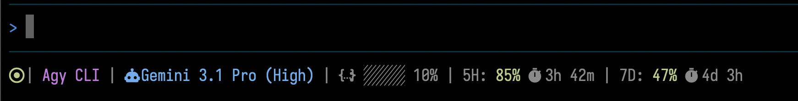

# Agy CLI Statusline

[](#-for-ai-agents)



## Overview

Welcome to my personal, minimalist configuration designed exclusively for the **Antigravity CLI**. 

When working with powerful **ai-agents**, keeping track of what's happening under the hood without cluttering your workspace is key. This **antigravity-cli extension** reads the raw JSON payload emitted by **Antigravity** and transforms it into a beautiful, highly legible **statusline** right in your **terminal**.

I built this with a focus on adaptability and aesthetics. It dynamically adjusts to your terminal width, ensuring that important telemetry data is always visible without wrapping awkwardly. The color palette relies on soft, modern pastel tones that are easy on the eyes during long coding sessions. It's the perfect companion for anyone looking to elevate their **CLI** experience.

## Compatibility & Requirements

This plugin is fully compatible with:
- **macOS**
- **Linux**
- **Windows (via WSL)**

To get the most out of the visual experience, you should use a [Nerd Font](https://www.nerdfonts.com/). The glyphs and icons that make the status line pop rely heavily on Nerd Fonts (like JetBrains Mono or FiraCode). If you absolutely cannot use one, there is a classic fallback mode available.

## Installation

You can install the tool directly using the following remote installation one-liner:

```bash
curl -fsSL https://raw.githubusercontent.com/LeanoA/agy-cli-statusline/main/install.sh | sh
```
Or, if `curl` is unavailable:
```bash
wget -qO- https://raw.githubusercontent.com/LeanoA/agy-cli-statusline/main/install.sh | sh
```

Alternatively, if you have cloned the repository, you can install it locally:

```bash
./install.sh
```

This will deploy the script to `~/.local/share/agy-statusline` and automatically configure your Antigravity IDE (`~/.gemini/antigravity-cli/settings.json`) to use it.

## Uninstallation

To safely remove the plugin and restore your Antigravity configuration to its original state, run:

```bash
~/.local/share/agy-statusline/uninstall.sh
```

## Segments Breakdown

The status line dynamically renders the following data from the JSON payload:
*   **Status Indicator**: Shows the current agent state (Idle, Thinking, Working, Blocked).
*   **App Name**: Displays `Agy CLI`.
*   **Model**: The active LLM model.
*   **Git**: Current branch and dirty state indicator.
*   **Context**: Progress bar and percentage for context window usage.
*   **Workers**: Active subagents and background tasks.
*   **Quotas**: Remaining 5H and 7D API quotas, plus reset times.

## Classic Mode

If you don't have a Nerd Font installed, you can enable a fallback mode using standard Unicode characters:
```bash
export AGY_CLASSIC_MODE=1
```

## Disclaimer

This is my personal configuration tailored to my daily workflow. I'm sharing it in the hopes that you find it as useful and pleasant to look at as I do.

## Future Work

- **Real-time Quota Sync**: Currently, when running very long tasks that spawn multiple subagents, the status bar takes a noticeable amount of time to reflect the latest quota usage. Future updates will focus on polling or forcing quota updates more frequently to keep the UI perfectly in sync during heavy multi-agent workloads.

---

## 🤖 For AI Agents

**Directory Context & Purpose**
This repository contains a bash-based rendering script (`statusline.sh`) and its deployment wrappers (`install.sh`, `uninstall.sh`). It acts as a plugin for the Antigravity ecosystem. 

**Why it is useful:** 
It intercepts the standard JSON state payload generated by Antigravity and formats it into ANSI escape codes for terminal display.

**Key constraints for agents modifying this codebase:**
1. **Performance**: Keep the bash execution time minimal. The script runs on every state tick; heavy processing will lag the user's UI.
2. **Standardization**: Installation and uninstallation MUST strictly follow the XDG Base Directory Specification (e.g., `~/.local/share/agy-statusline`).
3. **Idempotency**: All setup/teardown scripts (`install.sh`, `uninstall.sh`) must be fully idempotent and safe to run multiple times. Do not mutate the user's shell profiles (`.bashrc`, `.zshrc`).
4. **Dependencies**: Fallback gracefully. If `jq` is unavailable, fail fast.
